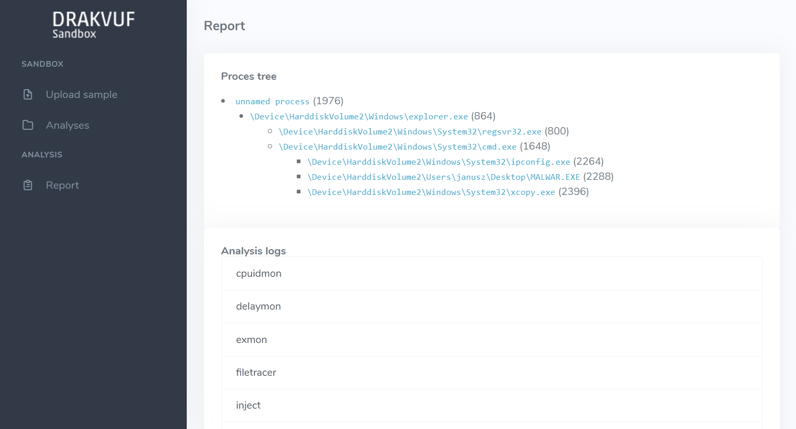
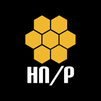

# DRAKVUF Sandbox

> [!WARNING]  
> 🛠️ Drakvuf Sandbox is right now under heavy development and not everything works smoothly, especially on the **master** branch.

DRAKVUF Sandbox is an automated black-box malware analysis system with [DRAKVUF](https://drakvuf.com/) engine under the hood, which does not require an agent on guest OS.

This project provides you with a friendly web interface that allows you to upload suspicious files to be analyzed. Once the sandboxing job is finished, you can explore the analysis result through the mentioned interface and get an insight on whether the file is truly malicious or not.

Because it is usually pretty hard to set up a malware sandbox, this project also provides you with an installer app that would guide you through the necessary steps and configure your system using settings that are recommended for beginners. At the same time, experienced users can tweak some settings or even replace some infrastructure parts to better suit their needs.

## Quick start
* **[👋 Getting started](https://drakvuf-sandbox.readthedocs.io/en/latest/usage/getting_started.html)**
* [Latest releases](https://github.com/CERT-Polska/drakvuf-sandbox/releases)
* [Latest docs](https://drakvuf-sandbox.readthedocs.io/en/latest/)

## Supported hardware & software

In order to run DRAKVUF Sandbox, your setup must fullfill all of the listed requirements.

* Processor:
  * ✔️ Required Intel processor with Intel Virtualization Technology (VT-x) and Extended Page Tables (EPT) features
* Host system with at least 2 core CPU and 5 GB RAM, running GRUB as bootloader, one of:
  * ✔️ Debian 10 Buster
  * ✔️ Ubuntu 18.04 Bionic
  * ✔️ Ubuntu 20.04 Focal
* Guest system, one of:
  * ✔️ Windows 7 (x64)
  * ✔️ Windows 10 build 2004 (x64)

Nested virtualization:

* ✔️ Xen - works out of the box.
* ✔️ VMware Workstation Player - works, but you need to check Virtualize EPT option for a VM; Intel processor with EPT still required.
* ✔️ KVM - works, however it is considered experimental. If you experience any bugs, please report them to us for further investigation.
* ❌ AWS, GCP, Azure - due to lack of exposed CPU features, hosting DRAKVUF Sandbox in the cloud is **not** supported (although it might change in the future).
* ❌ Hyper-V - doesn't work.
* ❌ VMWare Fusion (Mac) - doesn't work.

## Maintainers/authors

Feel free to contact us if you have any questions or comments.

**General contact email: info@cert.pl** (fastest response)

You can also chat with us about this project on Discord: [https://discord.gg/Q7eTsHnpn4](https://discord.gg/Q7eTsHnpn4)

This project is authored by:

* Michał Leszczyński ([@icedevml](https://github.com/icedevml))
* Adam Kliś ([@BonusPlay](https://github.com/BonusPlay))
* Hubert Jasudowicz ([@chivay](https://github.com/chivay))
* Paweł Srokosz ([@psrok1](https://github.com/psrok1))
* Konstanty Cieśliński ([@kscieslinski](https://github.com/kscieslinski))
* Arkadiusz Wróbel ([@catsuryuu](https://github.com/catsuryuu))
* Jarosław Jedynak ([@msm-cert](https://github.com/msm-cert))

If you have any questions about [DRAKVUF](https://drakvuf.com/) engine itself, contact tamas@tklengyel.com

## Acknowledgements

This project was created and/or upgraded thanks to the following organizations and initiatives:

### Connecting Europe Facility of the European Union

### The Honeynet Project

### CERT Polska

