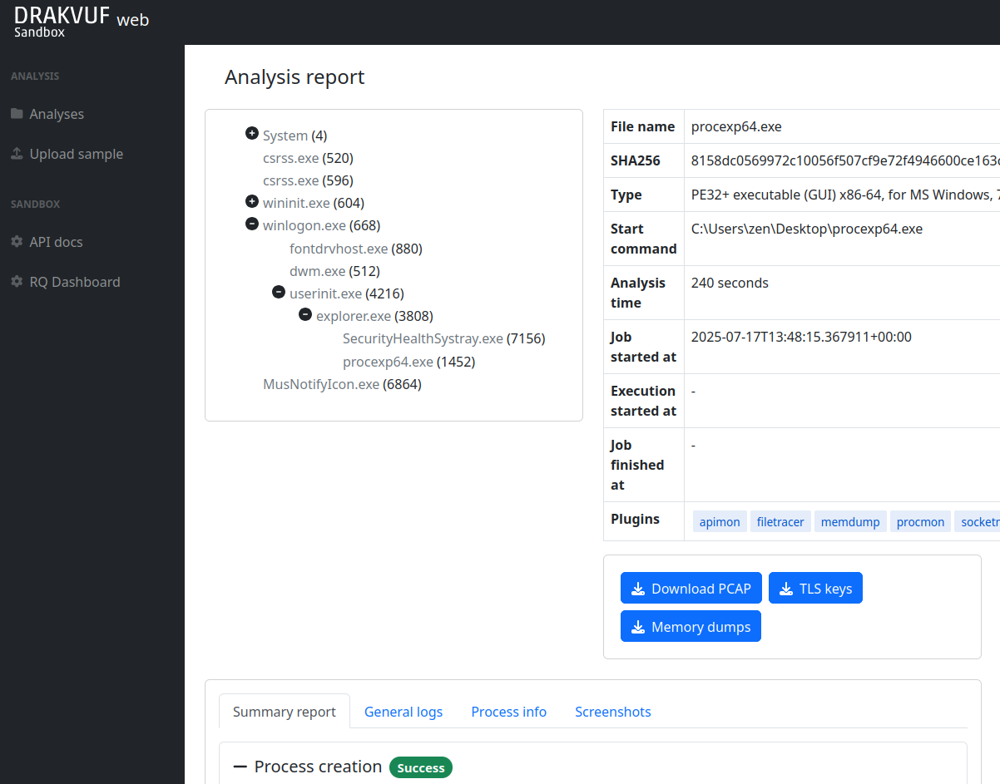

# DRAKVUF Sandbox
[](https://drone.icedev.pl/CERT-Polska/drakvuf-sandbox)

DRAKVUF Sandbox is an automated black-box malware analysis system with [DRAKVUF](https://drakvuf.com/) engine under the hood.

This project provides you with a friendly web interface that allows you to upload suspicious files to be analyzed. Once the sandboxing job is finished, you can explore the analysis result through the mentioned interface and get insight whether the file is truly malicious or not.

Because it is usually pretty hard to set up a malware sandbox, this project also provides you with an installer app that would guide you through the necessary steps and configure your system using settings that are recommended for beginners. At the same time, experienced users can tweak some settings or even replace some infrastructure parts to better suit their needs.



## Getting started

### Supported hardware&software

In order to run DRAKVUF Sandbox, your setup must fullfill all of the listed requirements:

* Processor: Intel processor with VT-x and EPT features
* Host system: Debian 10 Buster/Ubuntu 18.04 Bionic/Ubuntu 20.04 Focal with at least 2 core CPU and 5 GB RAM
* Guest system: Windows 7 (x64), Windows 10 (x64; experimental support)

### Basic installation

This instruction assumes that you want to create a single-node installation with the default components, which is recommended for beginners.

1. Download [latest release packages](https://github.com/CERT-Polska/drakvuf-sandbox/releases).
2. Install DRAKVUF:
   ```
   sudo apt update
   sudo apt install ./drakvuf-bundle*.deb
   sudo reboot
   ```
3. Install DRAKVUF Sandbox stack:
   ```
   sudo apt install redis-server
   sudo apt install ./drakcore*.deb
   sudo apt install ./drakrun*.deb
   ```
4. Execute:
   ```
   sudo draksetup install --iso /opt/path_to_windows.iso
   ```
   carefully read the command's output. This command would run a Virtual Machine with Windows system installation process.
   
   **Unattended installation:** If you have `autounattend.xml` matching your Windows ISO, you can request unattended installation by adding `--unattended-xml /path/to/autounattend.xml`. Unattended install configuration could be generated with [Windows Answer File Generator](https://www.windowsafg.com/win10x86_x64.html).
   
   **Storage backend:** By default, DRAKVUF Sandbox is storing virtual machine's HDD in a `qcow2` file. If you want to use ZFS instead, please check the "Optional features" section below.
5. Use VNC to connect to the installation process:
   ```
   vncviewer localhost:5900
   ```
6. Perform Windows installation until you are booted to the desktop.
7. Execute:
   ```
   sudo draksetup postinstall
   ```
8. Test your installation by navigating to the web interface ( http://localhost:6300/ ) and uploading some samples. The default analysis time is 10 minutes.

## Optional features

This sections contains various information about optional features that may be enabled when setting up DRAKVUF Sandbox.

### ZFS Storage backend
If you want to install DRAKVUF Sandbox with a ZFS storage backend, you should perform the following extra steps before executing `draksetup install` command:

1. Install ZFS on your machine (guide for: [Debian Buster](https://github.com/openzfs/zfs/wiki/Debian), [Ubuntu 18.04](https://ubuntu.com/tutorials/setup-zfs-storage-pool#2-installing-zfs))
2. Create a ZFS pool on a free partition:
   ```
   zpool create tank <partition_name>
   ```
   where `<partiton_name>` is e.g. `/dev/sda3`. Be aware that all data stored on the selected partition may be erased.
3. Create a dataset for DRAKVUF Sandbox:
   ```
   zfs create tank/vms
   ```
4. Execute `draksetup install` as in "Basic installation" section, but remembering to provide additional command line switches:
   ```
   --storage-backend zfs --zfs-tank-name tank/vms
   ```

### ProcDOT integration
DRAKVUF Sandbox may optionally draw a behavioral graph using [ProcDOT](https://www.procdot.com/), if `drakcore` will find it's binary installed at `/opt/procdot/procmon2dot`.

1. [Download ProcDOT](https://www.procdot.com/downloadprocdotbinaries.htm) (Linux version).
2. With your downloaded `procdot*_linux.zip` archive, execute the following commands:
   ```
   unzip -o procdot*_linux.zip lin64/* -d /tmp/procdot
   mv /tmp/procdot/lin64 /opt/procdot
   chmod +x /opt/procdot/procmon2dot
   ```
3. Your new analysis reports will also contain behavioral graphs.

### Networking (optional)

**Note:** Even though that the guest Internet connectivity is an optional feature, `drakrun` would always make some changes to your host system's network configuration:

Always:

* Each instance of `drakrun@<vm_id>` will create a bridge `drak<vm_id>`, assign `10.13.<vm_id>.1/24` IP address/subnet to it and bring the interface up.
* `drakrun` will drop any INPUT traffic originating from `drak<vm_id>` bridge, except DHCP traffic (UDP ports: 67, 68).

Only with `net_enable=1`:

* `drakrun` will enable IPv4 forwarding.
* `drakrun` will configure MASQUERADE through `out_interface` for packets originating from `10.13.<vm_id>.0/24`.
* `drakrun` will DROP traffic between `drak<X>` and `drak<Y>` bridges for `X != Y`.

In order to find out the exact details of the network configuration, search for `_add_iptable_rule` function usages in `drakrun/drakrun/main.py` file.

#### Basic networking
If you want your guest VMs to access Internet, you can enable networking by editing `[drakrun]`
section in `/etc/drakrun/config.ini`:

* Set `net_enable=1` in order to enable guest Internet access.
* Check if `out_interface` was detected properly (e.g. `ens33`) and if not, correct this setting.

After making changes to `/etc/drakrun`, you need to restart all `drakrun` services that are running
in your system:
 
```
systemctl restart 'drakrun@*'
```

Be aware that if your sandbox instance is already running some analyses, the above command will gracefully
wait up to a few minutes until these are completed.

#### Using dnschef
You may optionally configure your guests to use 

1. Setup [dnschef](https://github.com/iphelix/dnschef) tool.
2. Start `dnschef` in such way to make it listen on all `drak*` interfaces that belong to DRAKVUF Sandbox.
3. Set `dns_server=use-gateway-address` in `/etc/drakrun/config.ini`.
4. Restart your drakrun instances: `systemctl restart 'drakrun@*`

## Troubleshooting

### Checking service status

If your DRAKVUF Sandbox installation seems to work improperly, here are some commands that would help to troubleshoot the infrastructure.

Check service status:
```
drak-healthcheck
```

Check service logs:
```
journalctl -e -u drak-web
journalctl -e -u drak-system
journalctl -e -u drak-minio
journalctl -e -u drakrun@1
```

### Debug `device model did not start`

You may encounter the following error with `draksetup` command or `drakrun@*` service, which will prevent the VM from starting properly.

```
libxl: error: libxl_create.c:1676:domcreate_devmodel_started: Domain 4:device model did not start: -3
...
subprocess.CalledProcessError: Command 'xl create /etc/drakrun/configs/vm-0.cfg' returned non-zero exit status 3.
```

In such a case, you should inspect `/var/log/xen/qemu*.log` in order to determine the actual reason why the VM is refusing to start.

### Debug `can't allocate low memory for domain`

The following error with `draksetup` command or `drakrun@*` service means that your machine is missing memory resources:

```
xc: error: panic: xc_dom_boot.c:122: xc_dom_boot_mem_init: can't allocate low memory for domain: Out of memory
...
subprocess.CalledProcessError: Command 'xl create /etc/drakrun/configs/vm-0.cfg' returned non-zero exit status 3.
```

Resolutions:
* adjust the amount of memory dedicated to the Dom0 (host system) in `/etc/default/grub.d/xen.cfg` (look for `dom0_mem=2048M,max:2048M`) and run `update-grub && reboot`;
* adjust the amount of memory dedicated to the DomU (guest systems) in `/etc/drakrun/scripts/cfg.template` (`maxmem` and `memory` keys);

## Project contents

The project is divided into two main packages:

* `drakcore*.deb` - system core, provides a web interface, an internal task queue and object storage
* `drakrun*.deb` - sandbox worker, should be installed where you want to run your Virtual Machines (Intel CPU with VT-x and EPT is required)

Please note that the [DRAKVUF engine](https://github.com/tklengyel/drakvuf) is a separate project authored by Tamas K Lengyel.

### Sandbox Core

The system core package `drakcore*.deb` consists of the following services:

* `drak-web` - web interface that allows user to interact with the sandbox
* `drak-system` - internal task management system, using for dispatching jobs between workers
* `drak-minio` - builtin object storage on which analysis results are stored

### Sandbox Worker

A worker package `drakrun*.deb` is basically a wrapper around DRAKVUF project that spins off `drakrun` service instances. These instances are processing the queued suspicious files one after another, using appropriate infrastructure. This component also features a `draksetup` command that makes it easier to setup configuration that is necessary to run services.

## Building installation packages

In order to build installation packages on your own, you must [install Docker](https://docs.docker.com/install/linux/docker-ce/debian/) on your machine.

### DRAKVUF Sandbox (drakcore, drakrun)

You may build your packages from source using following commands:

```
git clone https://github.com/CERT-Polska/drakvuf-sandbox.git
cd drakvuf-sandbox
sudo ./drakcore/package/build.sh
sudo ./drakrun/package/build.sh
```

Afterwards, you should find your installation packages produced in `out/` directory.

### DRAKVUF (drakvuf-bundle)

The build scripts for `drakvuf-bundle` are part of [tklengyel/drakvuf](https://github.com/tklengyel/drakvuf) repository. You may build your package using the following commands:

```
git clone --recursive https://github.com/tklengyel/drakvuf
cd drakvuf
sudo ./package/build.sh
```

The resulting package will be produced to `package/out/` directory.

## Maintainers/authors

Feel free to contact us if you have any questions or comments.

* Michał Leszczyński - monk@cert.pl
* Adam Kliś - bonus@cert.pl
* Hubert Jasudowicz - chivay@cert.pl

If you have any questions about [DRAKVUF](https://drakvuf.com/) engine itself, contact tamas@tklengyel.com

## CEF Notice


