===========
Basic usage
===========

This chapter walks you through the core workflow of using the DRAKVUF Sandbox, from uploading a file to exploring results and using the API.

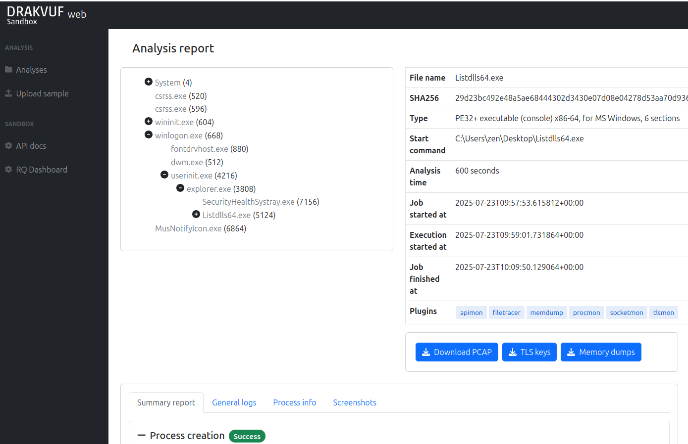

Uploading a file for analysis
=============================

To begin, click the “Upload File” option in the sidebar menu.

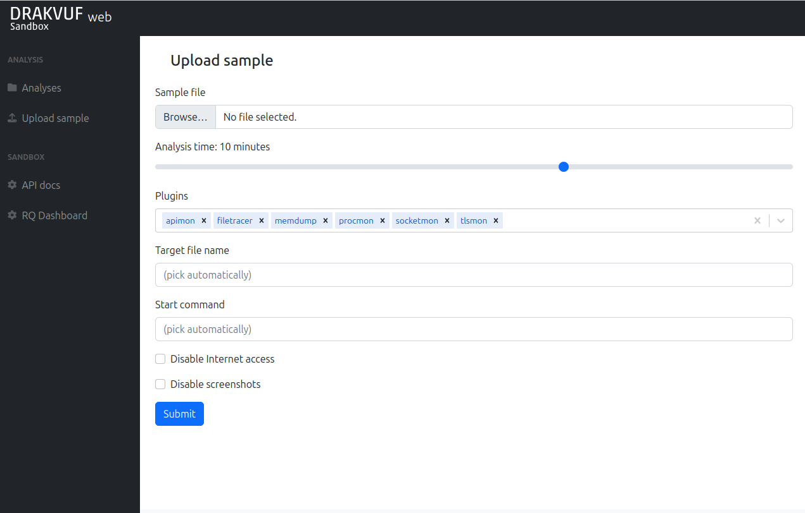

You'll see the upload form with the following fields:

- **Sample file**:
  The malware sample you want to analyze.
- **Analysis time**:
  Duration in minutes for which the sandbox will monitor the sample's behavior. Note: The total analysis process may take slightly longer, as this time does not include system preparation steps like VM startup or environment setup.
- **Plugins**:
  DRAKVUF plugins to enable during analysis. Default plugins are:

  - **apimon** - monitor for user-mode WinAPI calls
  - **filetracer** - monitor for file operations (from the kernel point of view)
  - **memdump** - makes dumps of interesting memory regions
  - **procmon** - this plugin is crucial for getting information about running processes
    in the system. It's highly recommended to always include this plugin in all analyses.
  - **socketmon** - monitor TCP/UDP connections and DNS queries
  - **tlsmon** - look for TLS master key for further decryption

- **Target file name**:
  The name (or full path) the file will have inside the guest VM. Useful if the malware behaves differently based on filename, or you want to use a different file extension.
- **Start command**:
  A custom command to execute the same inside the guest.
- **Disable internet access**:
  When enabled, the guest VM will be isolated from the internet. Useful for preventing malware from contacting external servers.
- **Disable screenshots**:
  Disables periodic screenshots of the guest VM during analysis. This can reduce storage usage.

`DRAKVUF plugins <https://github.com/tklengyel/drakvuf/tree/main/src/plugins>`_ are monitor modules intercepting various system behavior. Enabling too many plugins will highly affect the execution performance, so plugin choice is always the matter of good compromise between efficiency and performance.

You can pick any plugin you want. If it doesn't appear on the list, just write arbitrary name and press Enter. The plugin will be added to the list with a warning that "plugin may be not supported".

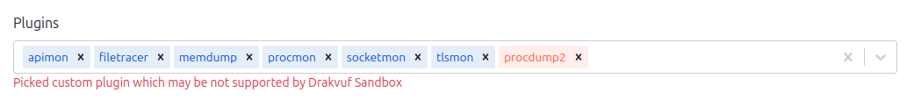

Other recommended plugins that are not selected by default are:

* **clipboardmon** - monitors clipboard operations
* **delaymon** - looks for NtDelayExecution
* **exmon** - intercepts exceptions
* **hidsim** - HID simulation, by default performs random mouse movements during analysis
* **regmon** - intercepts Registry operations
* **syscalls** - intercepts syscalls (may need extra configuration)

Waiting for an analysis to finish, live interaction
~~~~~~~~~~~~~~~~~~~~~~~~~~~~~~~~~~~~~~~~~~~~~~~~~~~

When you click **Submit**, you'll be redirected to the analysis status page.

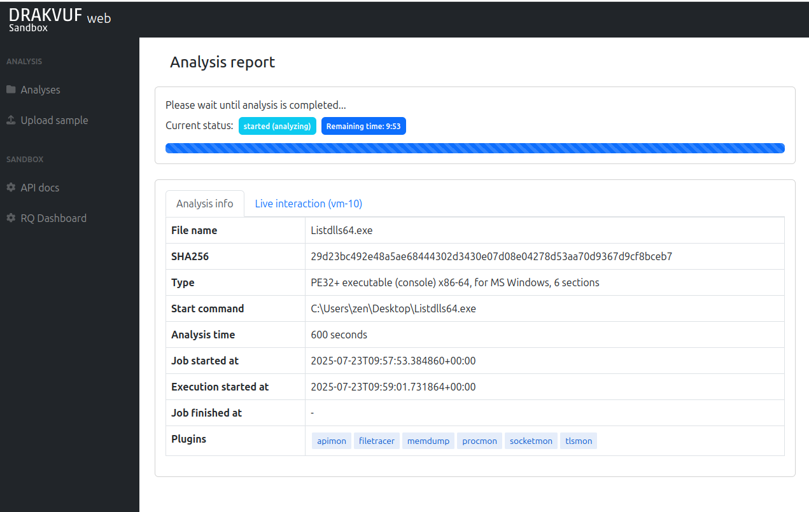

The possible statuses are:

- **queued** - Analysis is waiting for a worker to pick it up
- **started (starting_vm)** - VM snapshot is getting restored
- **started (preparing_vm)** - Preparation commands are launched (post-restore scripts). Live interaction is turned on.
- **started (analyzing)** - Sample is executed and its behavior is monitored.
- **started (postprocessing)** - Guest VM is destroyed and logs are postprocessed and analysis report is getting prepared.
- **started (done)** - Analysis is done, but some last finalization operations are still performed (e.g. analysis files upload)
- **finished** - Analysis is finished successfully.
- **failed** - Analysis is finished but something went wrong during analysis process.

When VM is started, you can interact with it via Live interaction tab. After you authenticate with your VNC password, you'll be able to interact with the system during analysis process:

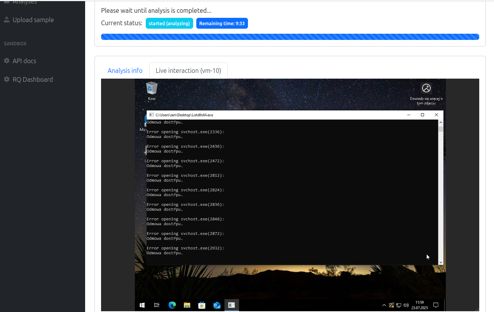

Viewing analysis results
========================

After the analysis is complete, you’ll be taken to the results page, where the sandbox’s observations are presented in a report. Here's what you'll find:

Process tree
~~~~~~~~~~~~

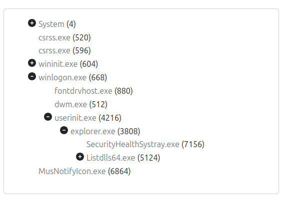

Process tree contains all processes that appeared in the system during analysis. By default only the "explorer.exe" children are expanded.

The process tree uses color coding to help you understand how and when each process was created:

- **Gray** processes were already running before monitoring began. This includes the sample itself, since DRAKVUF starts observing *after* the process is launched.
- **Standard (default-colored)** processes were created and fully executed during the monitoring window. They started and finished while the sandbox was actively watching.
- **Blue (highlighted)** processes were started during the analysis but were still running when the monitoring ended. They may indicate long-running or persistent behavior

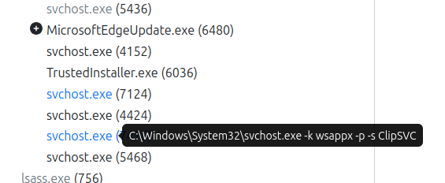

If the process was launched with additional arguments, you can hover your mouse over it to view the full command line.

Artifact download
~~~~~~~~~~~~~~~~~

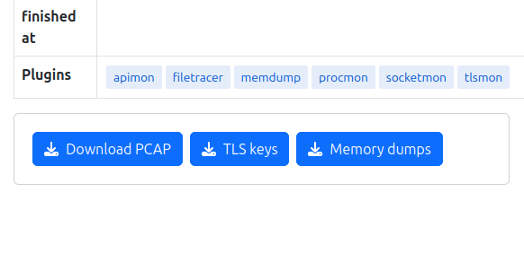

On the right side of the process tree, you'll find the basic analysis information and download buttons:

- **Download PCAP** - downloads network traffic recorded during monitoring
- **TLS keys** - downloads intercepted TLS master keys by tlsmon (if any)
- **Memory dumps** - downloads ZIP file with dumped memory regions by memdump plugin (if any)

Summary report
~~~~~~~~~~~~~~

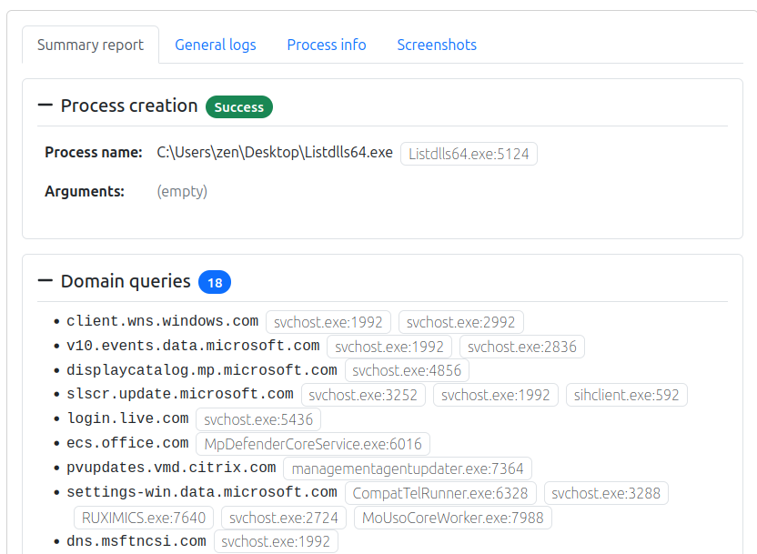

Summary report contains major information about sample execution. It is divided into the following sections:

- **Process creation** - information about process created for uploaded file. If process exited during analysis, this section shows the exit code.
- **Domain queries** - Queried domains with processes that performed that query. This information is extracted from DnsQueryEx calls registered by socketmon.
- **HTTP requests** - Information about performed HTTP requests, correlated from WinAPI calls registered by apimon.
- **Cracked URLs** - Observed URLs from InternetCrackUrl/InternetCreateUrl and similar functions.
- **Connections** - TCP/UDP connections made by processes and intercepted by socketmon.
- **Modified files** - Files opened for modification and written found by filetracer.
- **Deleted files** - Files opened and marked for deletion found by filetracer.
- **TTPs** - high-level indicators from CAPA rules and apimon/syscall logs.

All observations contained in this section are based on DRAKVUF output, so if you're looking for exact information about connections, PCAP file should be inspected as well.

General logs
~~~~~~~~~~~~

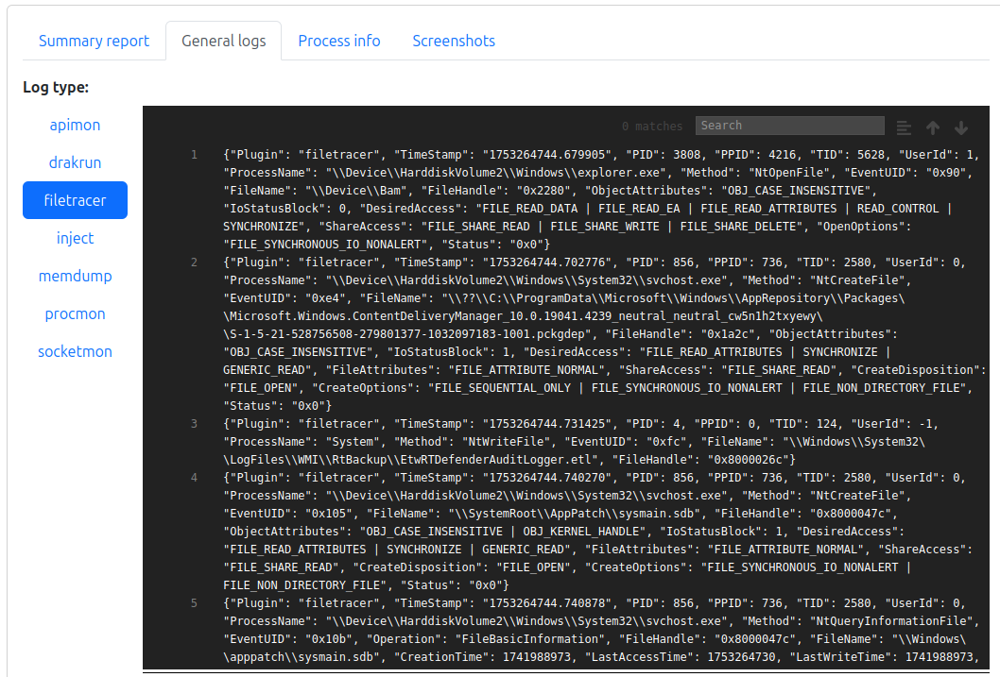

"General logs" tab contains various logs collected during analysis:

- **drakrun** - log from the DRAKVUF Sandbox worker. If something went wrong, the possible reason may be found here
- **parse_errors** - log entries that DRAKVUF Sandbox was unable to parse during postprocessing
- **inject** - information about initial process creation
- other logs are coming from plugins

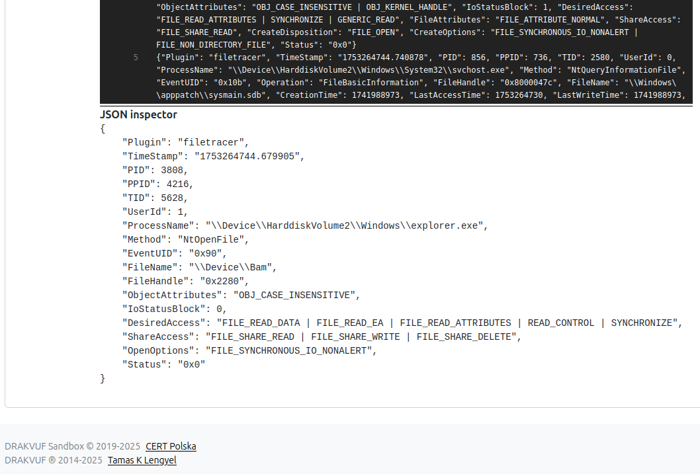

Clicking on a log entry opens the JSON inspector, where the log line is displayed in a more readable format.

Process info
~~~~~~~~~~~~

.. image:: ../_static/process_info.png
  :alt: Process info tab

The Process info tab provides similar details to the General Logs, but focuses on a single process and includes enhanced filtering options.

Go to the "Process info" tab and click on a process in Process tree.

The first section shows basic process information. Other sections contain filtered logs.

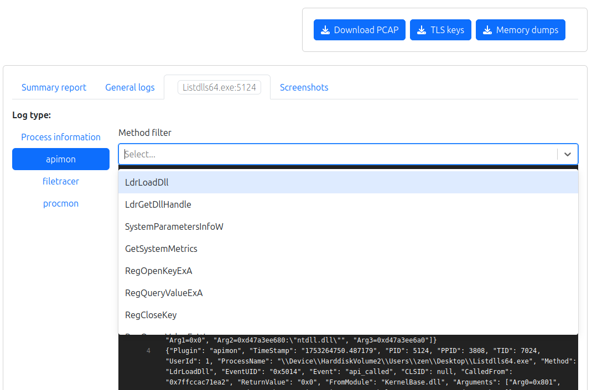

The log view includes additional filtering by Method, allowing you to select one or more methods to narrow down the displayed entries.

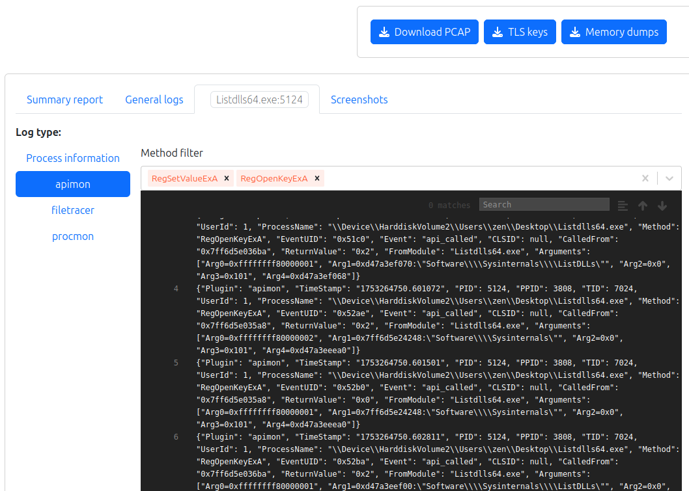

For example, you can filter logs to show only specific function calls like RegSetValueExA or RegOpenKeyExA, helping you focus on particular types of behavior

Screenshots
~~~~~~~~~~~

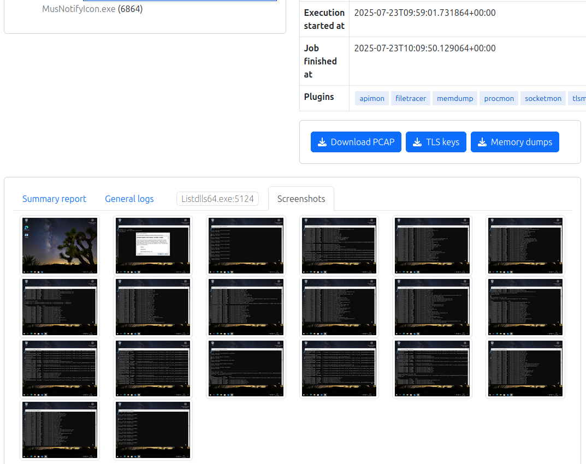

The final tab, Screenshots, displays a series of unique images captured during the analysis, shown in the order they were taken. These screenshots are taken at regular intervals and help visualize what was happening inside the virtual machine — such as pop-ups, error messages, or ransomware notes.

Viewing recent analyses
=======================

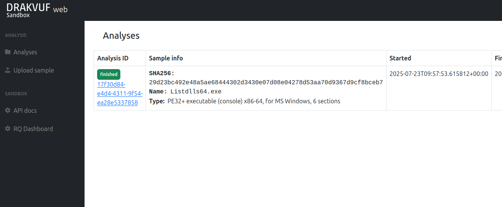

Your completed analyses will be available in the Analyses view.

DRAKVUF Sandbox remembers only 100 recent analyses in this list (the list is stored in Redis), but all analyses are reachable by their ID.
